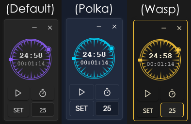

# Obsidian Pomodoro Widget Plugin

This is a plugin for Obsidian (https://obsidian.md), which adds a pomodoro clock widget to the application. It's based off of the original pomodoro kitchen timer which needs to be wound to set the time and ticks constantly while active to keep you focused, though this widget can also be set with a button and resets automatically. Also provides a stopwatch.
You can customize whether the widget toggle appears in the ribbon or status bar, or only as a command. Dragging the widget to a corner will anchor it to that corner so you can resize the window.

## Theme support

This plugin uses the official style names so the widget will adapt to any theme. 
### Some examples:

If you want to customize it refer to styles.css for the class names. All names start with '*pomo-*'.

## Installing the plugin

- Download `main.js`, `styles.css`, `manifest.json`, from the releases page and add them to the `.obsidian/plugins/pomodoro-widget/` folder in your vault.

# For plugin devs

I've separated the widget functionality from the clock so you should be able to use the widget class in your own plugins without much hassle, just make sure you copy the relevant styles ('*pomo-hidden, pomo-widget-\**').

## Building from source

- Clone the repo into the `.obsidian/plugins/` folder in your vault.
- Make sure your NodeJS is at least v16 (`node --version`).
- `npm i` or `yarn` to install dependencies.
- `npm run build` to generate the `main.js` file.

## Contributing

This project is open to contributions, simply submit a pull request.